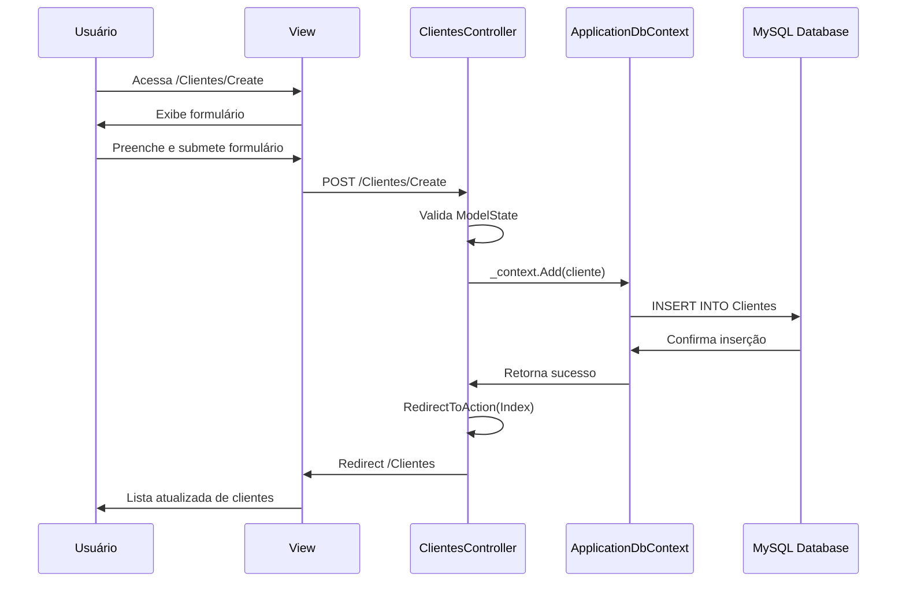

# Arquitetura do Sistema - CrudApplication

## 🏗️ Visão Geral da Arquitetura

O CrudApplication segue o padrão arquitetural **MVC (Model-View-Controller)** do ASP.NET Core, implementando uma arquitetura em camadas que separa as responsabilidades do sistema.

## 📐 Diagrama de Arquitetura

```
┌─────────────────────────────────────────────────────────────┐
│                    CAMADA DE APRESENTAÇÃO                    │
├─────────────────────────────────────────────────────────────┤
│  Views (Razor)     │  Controllers      │  Static Files      │
│  - Clientes/       │  - ClientesCtrl   │  - CSS/JS          │
│  - Produto/        │  - ProdutoCtrl    │  - Bootstrap       │
│  - Shared/         │  - HomeCtrl       │  - jQuery          │
└─────────────────────────────────────────────────────────────┘
                              │
                              ▼
┌─────────────────────────────────────────────────────────────┐
│                     CAMADA DE APLICAÇÃO                      │
├─────────────────────────────────────────────────────────────┤
│  Models           │  Data Context      │  Services          │
│  - Cliente        │  - ApplicationDb   │  - Entity Framework│
│  - Produto        │  - DbContext       │  - Dependency Inj. │
│  - ErrorViewModel │  - DbSets          │  - Validation      │
└─────────────────────────────────────────────────────────────┘
                              │
                              ▼
┌─────────────────────────────────────────────────────────────┐
│                    CAMADA DE DADOS                          │
├─────────────────────────────────────────────────────────────┤
│  MySQL Database   │  Migrations        │  Entity Relations  │
│  - cadastrodb     │  - InitialCreate   │  - Cliente → Produto│
│  - Clientes Table │  - Schema Updates  │  - Foreign Keys    │
│  - Produtos Table │  - Data Seeding    │  - Constraints     │
└─────────────────────────────────────────────────────────────┘
```

## 🔧 Componentes Principais

### 1. Camada de Apresentação (Presentation Layer)

#### Controllers
- **ClientesController**: Gerencia todas as operações CRUD para clientes
- **ProdutoController**: Gerencia todas as operações CRUD para produtos
- **HomeController**: Controla a página inicial e páginas de erro

#### Views
- **Razor Views**: Templates HTML com sintaxe Razor para renderização dinâmica
- **Layouts**: Template base (`_Layout.cshtml`) compartilhado entre todas as páginas
- **Partial Views**: Componentes reutilizáveis como validação de scripts

### 2. Camada de Aplicação (Application Layer)

#### Models (Modelos de Domínio)
```csharp
// Cliente.cs
public class Cliente
{
    public int IdCliente { get; set; }        // Chave primária
    public string Nome { get; set; }          // Campo obrigatório
    public string Sobrenome { get; set; }     // Campo obrigatório
    public string Email { get; set; }         // Campo obrigatório + validação
    public DateTime DataCadastro { get; set; } // Data automática
    public bool Ativo { get; set; }           // Status
    public ICollection<Produto> Produtos { get; set; } // Relacionamento
}

// Produto.cs
public class Produto
{
    public int IdProduto { get; set; }        // Chave primária
    public string Nome { get; set; }          // Campo obrigatório
    public decimal Valor { get; set; }        // Valor monetário
    public bool Disponivel { get; set; }      // Status de disponibilidade
    public int IdCliente { get; set; }        // Chave estrangeira
    public Cliente Cliente { get; set; }      // Propriedade de navegação
}
```

#### Data Context
```csharp
public class ApplicationDbContext : DbContext
{
    public ApplicationDbContext(DbContextOptions<ApplicationDbContext> options) : base(options)
    
    // DbSets para acesso às entidades
    public DbSet<Cliente> Clientes { get; set; }
    public DbSet<Produto> Produtos { get; set; }
}
```

### 3. Camada de Dados (Data Layer)

#### Banco de Dados MySQL
- **Servidor**: MySQL Server
- **Banco**: `cadastrodb`
- **Porta**: 3306 (padrão)

#### Estrutura das Tabelas

**Tabela Clientes**
```sql
CREATE TABLE Clientes (
    IdCliente INT AUTO_INCREMENT PRIMARY KEY,
    Nome VARCHAR(50) NOT NULL,
    Sobrenome VARCHAR(100) NOT NULL,
    Email VARCHAR(150) NOT NULL UNIQUE,
    DataCadastro DATETIME NOT NULL,
    Ativo BOOLEAN NOT NULL DEFAULT TRUE
);
```

**Tabela Produtos**
```sql
CREATE TABLE Produtos (
    IdProduto INT AUTO_INCREMENT PRIMARY KEY,
    Nome VARCHAR(100) NOT NULL,
    Valor DECIMAL(18,2) NOT NULL,
    Disponivel BOOLEAN NOT NULL DEFAULT TRUE,
    IdCliente INT NOT NULL,
    FOREIGN KEY (IdCliente) REFERENCES Clientes(IdCliente)
);
```

## 🔄 Fluxo de Dados

### Fluxo de Requisição Típica (CRUD)

1. **Requisição HTTP** → Controller
2. **Controller** → Validação de entrada
3. **Controller** → ApplicationDbContext
4. **DbContext** → Entity Framework Core
5. **EF Core** → MySQL Database
6. **Database** → Retorna dados
7. **EF Core** → Mapeia para Models
8. **Models** → Controller
9. **Controller** → View (Razor)
10. **View** → HTML renderizado → Cliente

### Exemplo: Criação de Cliente



## 🛡️ Padrões de Segurança Implementados

### 1. Validação de Entrada
- **Data Annotations**: Validação declarativa nos models
- **ModelState.IsValid**: Verificação no controller
- **Client-side validation**: Validação JavaScript com jQuery

### 2. Proteção CSRF
- **ValidateAntiForgeryToken**: Tokens anti-falsificação
- **@Html.AntiForgeryToken()**: Tokens nas views

### 3. Proteção Overposting
- **Bind Attribute**: Especifica quais propriedades podem ser alteradas
- **Selective Binding**: Proteção contra ataques de manipulação

## 📦 Gerenciamento de Dependências

### NuGet Packages
```xml
<PackageReference Include="Microsoft.EntityFrameworkCore.Tools" Version="9.0.9" />
<PackageReference Include="Microsoft.VisualStudio.Web.CodeGeneration.Design" Version="8.0.7" />
<PackageReference Include="Pomelo.EntityFrameworkCore.MySql" Version="9.0.0" />
```

### Injeção de Dependência
```csharp
// Program.cs
builder.Services.AddDbContext<ApplicationDbContext>(options =>
    options.UseMySql(connectionString, ServerVersion.AutoDetect(connectionString)));

builder.Services.AddControllersWithViews();
```

## 🔧 Configurações

### Connection String
```json
{
  "ConnectionStrings": {
    "DefaultConnection": "Server=localhost;Port=3306;Database=cadastrodb;Uid=root;Pwd=;"
  }
}
```

### Launch Settings
- **HTTP**: `http://localhost:5031`
- **IIS Express**: `http://localhost:62771`
- **Environment**: Development

## 📊 Relacionamentos de Dados

### Relacionamento Cliente-Produto
- **Tipo**: One-to-Many (1:N)
- **Cliente**: Um cliente pode ter vários produtos
- **Produto**: Cada produto pertence a um único cliente
- **Implementação**: Foreign Key `IdCliente` na tabela `Produtos`

### Navegação
```csharp
// Cliente → Produtos
public virtual ICollection<Produto>? Produtos { get; set; }

// Produto → Cliente
[ForeignKey("IdCliente")]
public virtual Cliente? Cliente { get; set; }
```

## 🚀 Performance e Otimizações

### Entity Framework Core
- **Lazy Loading**: Carregamento sob demanda
- **Include()**: Carregamento explícito de relacionamentos
- **Async/Await**: Operações assíncronas para melhor performance

### Exemplo de Otimização
```csharp
// Carrega produtos com informações do cliente
var applicationDbContext = _context.Produtos.Include(p => p.Cliente);
```

## 🔄 Migrações e Versionamento

### Sistema de Migrações
- **InitialCreate**: Criação inicial das tabelas
- **ModelSnapshot**: Estado atual do modelo
- **Auto-detection**: Detecção automática de mudanças

### Comandos EF Core
```bash
dotnet ef migrations add NomeDaMigracao
dotnet ef database update
dotnet ef migrations remove
```

## 📈 Escalabilidade e Manutenibilidade

### Pontos Fortes
- ✅ Separação clara de responsabilidades
- ✅ Padrão MVC bem implementado
- ✅ Entity Framework Core para abstração de dados
- ✅ Validações robustas
- ✅ Código bem estruturado e documentado

### Possíveis Melhorias
- 🔄 Implementar Repository Pattern
- 🔄 Adicionar camada de serviços
- 🔄 Implementar Unit of Work
- 🔄 Adicionar logging estruturado
- 🔄 Implementar cache
- 🔄 Adicionar testes unitários
- 🔄 Implementar API REST
